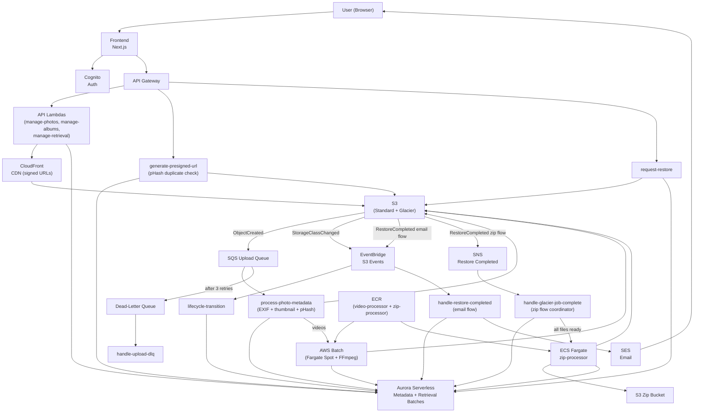

# PSILO

- [Summary](#summary)
- [Getting Started](#getting-started)
- [Project Structure](#project-structure)
- [Tech Stack](#tech-stack)
- [AWS Architecture](#aws-architecture)
- [Key Decisions](#key-decisions)
- [Status](#status)

# Summary

P*ersonal* Silo. A personal cloud storage built with AWS, NextJS, Typescript. Designed as a self-hosted alternative to commercial storage solutions. Optimized for cost using S3 Glacier Flexible Retrieval for cold storage.

Built as a learning project to explore AWS architecture, CDK infrastructure-as-code,
and full-stack TypeScript. Integrated with Claude Code for AI-assisted development.

# Getting Started

## Prerequisites

- Node.js v22+
- AWS CLI configured with appropriate credentials
- AWS CDK v2
- An AWS account

## AWS Service (Auto-provisioned via CDK)

- Provisioned automatically via AWS CDK. See `infrastructure/` for the full stack definition.
  - Core services include:
    - Cognito - authentication
    - API Gateway + Lambda - request handling and business logic
    - S3 - object storage with lifecycle rules (originals transition to Glacier)
    - CloudFront - CDN for thumbnail/preview delivery with signed URLs (24h TTL)
    - SQS + DLQ - for async metadata processing and thumbnail generation
    - EventBridge - listens for S3 storage class transitions and Glacier restore completions
    - Aurora Serverless v2 - stores users, photo metadata, storage class state, retrieval batches
    - AWS Batch (Fargate Spot) + ECR - video thumbnail and preview generation via FFmpeg
    - ECS Fargate (Spot) + ECR - batch Glacier zip download pipeline
    - SES - email notifications when Glacier restores complete (single-file flow)

# Project Structure

```
├── frontend/                        # Next.js app
├── infrastructure/                  # AWS CDK stacks
│     └── lib/constructs/            # CDK constructs (storage, database, auth, upload-pipeline,
│                                    #   video-pipeline, cdn, zip-pipeline, api)
└── services/                        # Lambda functions + shared code
      ├── generate-presigned-url/    # pHash duplicate check + presigned PUT URL
      ├── manage-photos/             # List, delete, storage stats, trash (CloudFront signed URLs)
      ├── manage-albums/             # CRUD albums + album-photo associations (CloudFront signed URLs)
      ├── manage-retrieval/          # List retrieval batches and per-file restore status
      ├── request-restore/           # POST /files/restore — presigned URL or Glacier restore
      ├── handle-restore-completed/  # EventBridge — SES email when Glacier restore finishes (email flow)
      ├── handle-glacier-job-complete/ # SNS — coordinates zip pipeline when all files are restored
      ├── user-provisioning/         # Post-Cognito confirmation setup
      ├── process-photo-metadata/    # EXIF + thumbnail (images) + pHash; submits Batch jobs (videos)
      ├── lifecycle-transition/      # Tracks S3 Glacier transitions (EventBridge)
      ├── handle-upload-dlq/         # Dead-letter queue handler
      ├── purge-deleted-photos/      # Daily cron — hard-deletes soft-deleted photos past retention
      ├── batch/
      │     ├── video-thumbnail-processor/  # Fargate job: FFmpeg thumbnail + 5s preview generation
      │     └── zip-processor/             # Fargate job: stream restored files → zip → S3
      ├── shared/                    # Schema + DB client + CloudFront signer + pHash (bundled by esbuild)
      └── migrations/                # Drizzle SQL migrations (0000–0017)
```

### Frontend

The user-facing application built with Next.js and Typescript. Handles all UI routing and client-side logic. Communicates with backend services via API Gateway through the BFF pattern.

### Infrastructure

AWS CDK project that provisions and manages all cloud resources. Running the CDK deploy will automatically set up all required AWS services. See `infrastructure/` for stack definitions.

### Services

Lambda functions written in TypeScript, each handling a specific domain. Deployed automatically as part of the infrastructure stack. Shared code lives in `services/shared/` and is bundled by esbuild at deploy time.

# Tech Stack

| Layer          | Technology                            |
| -------------- | ------------------------------------- |
| Frontend       | Next.js, TypeScript                   |
| Backend        | AWS Lambda, Node.js v22+              |
| Database       | Aurora Serverless v2 (Drizzle ORM)    |
| Infrastructure | AWS CDK (construct-per-domain)        |
| Storage        | S3 Glacier Flexible Retrieval         |
| CDN            | CloudFront (signed URLs, edge cache)  |
| Auth           | Cognito                               |
| Queue          | SQS + DLQ                             |
| Video          | AWS Batch (Fargate Spot) + FFmpeg     |
| Zip Download   | ECS Fargate Spot + archiver           |
| Email          | SES                                   |
| Registry       | ECR                                   |

# AWS Architecture



# Status

Currently in active development

- [x] Infrastructure Setup
- [x] Authentication (Cognito)
- [x] File Upload
- [x] File Retrieval
- [x] Album Management (CRUD, rename)
- [x] Thumbnail generation (JPEG/GIF/WebP format-preserving, 800×800, served from Standard)
- [x] S3 Glacier lifecycle for originals (cost optimization)
- [x] Storage usage dashboard with per-class cost breakdown + retrieval cost estimates
- [x] Infinite scroll on dashboard and album detail
- [x] Bulk photo delete
- [x] Trash bin + photo restore
- [x] Video support (upload + thumbnail cover + hover preview via AWS Batch + FFmpeg)
- [x] Full-resolution photo viewer (STANDARD: full-res; GLACIER: thumbnail fallback)
- [x] Full-resolution photo download (Standard: immediate presigned URL; Glacier: restore + SES email)
- [x] Batch Glacier album download (zip pipeline via ECS Fargate Spot)
- [x] Glacier restore tier selection (Expedited / Standard / Bulk)
- [x] Retrieval batch tracking + restore requests page with Download Zip button
- [x] CloudFront CDN for thumbnail/preview delivery (24h edge caching)
- [x] pHash perceptual duplicate detection at upload time
- [x] CDK stack refactored into per-domain constructs
- [ ] Photo sorting and filtering
- [ ] Settings page

# Key Decisions

- **NextJS** - frontend tech stack. [ADR-001](documentation/ADRs/001-use-nextjs.md)
- **Monorepo** - repository architecture. [ADR-002](documentation/ADRs/002-implement-monorepo.md)
- **AWS** - cloud service provider. [ADR-003](documentation/ADRs/003-leverage-aws-background.md)
- **AWS S3 Glacier Flexible** - cost optimization for cold storage. [ADR-004](documentation/ADRs/004-using-S3-glacier-flexible.md)
- **AWS Aurora Serverless v2** - database. [ADR-005](documentation/ADRs/005-using-aurora-serverless.md)
- **Drizzle** - database ORM. [ADR-006](documentation/ADRs/006-using-drizzle.md)
- **Backend for Frontends (BFF) Pattern** - design pattern for the App. [ADR-007](documentation/ADRs/007-using-bff-approach.md)
- **SQS for async photo metadata processing** - decoupled background processing with DLQ. [ADR-008](documentation/ADRs/008-sqs-async-photo-processing.md)
- **Aurora Data API (no VPC)** - Lambda-to-database connectivity without NAT gateways. [ADR-009](documentation/ADRs/009-aurora-data-api-no-vpc.md)
- **Thumbnail generation pipeline** - fast grid loading while keeping originals in Glacier. [ADR-010](documentation/ADRs/010-thumbnail-generation-pipeline.md)
- **EventBridge for storage class tracking** - sync Glacier transition state to DB without polling. [ADR-011](documentation/ADRs/011-eventbridge-storage-class-tracking.md)
- **AWS Batch (Fargate Spot) for video thumbnails** - FFmpeg video processing outside Lambda constraints. [ADR-012](documentation/ADRs/012-aws-batch-video-thumbnails.md)
- **CloudFront signed URLs** - edge-cached thumbnail/preview delivery with access control. [ADR-013](documentation/ADRs/013-cloudfront-signed-urls.md)
- **pHash duplicate detection** - perceptual hashing to catch near-duplicate uploads before storage. [ADR-014](documentation/ADRs/014-phash-duplicate-detection.md)
- **ECS Fargate zip pipeline for batch Glacier downloads** - single zip download for album restores. [ADR-015](documentation/ADRs/015-batch-glacier-zip-download.md)
