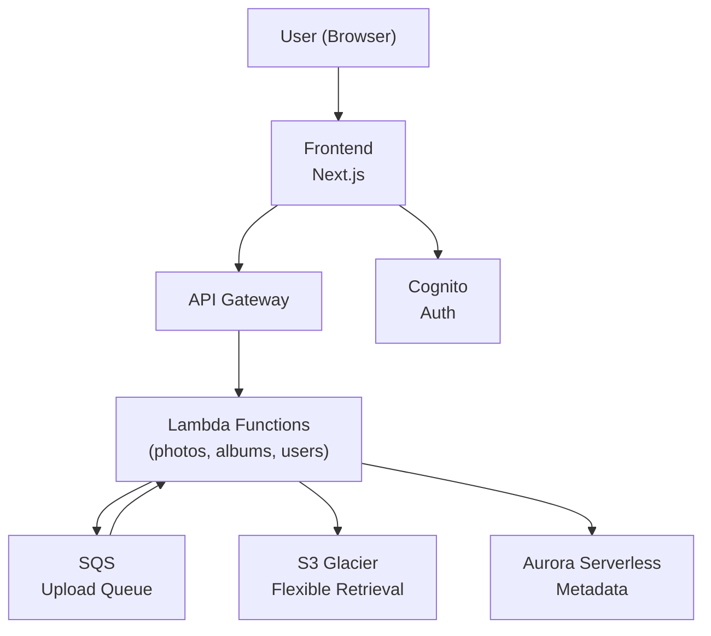

# PSILO

- [Summary](#summary)
- [Getting Started](#getting-started)
- [Project Structure](#project-structure)
- [Tech Stack](#tech-stack)
- [AWS Architecture](#aws-architecture)
- [Key Decisions](#key-decisions)

# Summary

P*ersonal* Silo. A personal cloud storage built with AWS, NextJS, Typescript. Designed as a self-hosted alternative to commercial storage solutions. Optimized for cost using S3 Glacier Flexible Retrieval for cold storage.

Built as a learning project to explore AWS architecture, CDK infrastructure-as-code,
and full-stack TypeScript. Integrated with Claude Code for AI-assisted development.

# Getting Started

## Prerequisites

- Node.js v22+
- AWS CLI configured with appropriate credentials
- AWS CDK v2
- An AWS account

## AWS Service (Auto-provisioned via CDK)

- Provisioned automatically via AWS CDK. See `infrastructure/` for the full stack definition.
  - Core services include:
    - Cognito - authentication
    - API Gateway + Lambda - request handling and business logic
    - S3 - object storage
    - SQS - for metadata processing
    - Aurora Serverless v2 - stores users and photo metadata

# Project Structure

```
├── frontend/         # Next.js app
├── infrastructure/   # AWS CDK stacks
└── services/         # Lambda functions
      ├── shared/     # RDS Schema
      └── migrations/ # Migrations
```

### Frontend

The user-facing application built with Next.js and Typescript. Handles all UI routing, and client-side logic. Communicates with backend services via API Gateway.

### Infrastructure

AWS CDK project that provisions and manages all cloud resources. Running the CDK deploy here will automatically set up all required AWS Services (Cognito, Lambda, API Gateway, etc). see `infrastructure/` for stack definitions.

### Services

Lambda functions written in Typescript, each handling a specific domain (photos, albums, etc). Deployed automatically as a part of the infrastructure stack.

# Tech Stack

| Layer          | Technology                      |
| -------------- | ------------------------------- |
| Frontend       | Next.js, TypeScript             |
| Backend        | AWS Lambda, Node.js v22+        |
| Database       | Aurora Serverless (Drizzle ORM) |
| Infrastructure | AWS CDK                         |
| Storage        | S3 Glacier Flexible Retrieval   |
| Auth           | Cognito                         |
| Queue          | SQS                             |

# AWS Architecture



# Status

🚧 Currently in active development

- [x] Infrastructure Setup
- [x] Authentication (Cognito)
- [x] File Upload
- [x] File Retrieval
- [x] Album Management
- [ ] Storage usage dashboard
- [ ] Photo sorting and filtering
- [ ] Image optimization

# Key Descisions

- **NextJS** - frontend tech stack. [ADR-001](documentation/ADRs/001-use-nextjs.md)
- **Monorepo** - repository architecture. [ADR-002](documentation/ADRs/002-implement-monorepo.md)
- **AWS** - cloud service provider. [ADR-003](documentation/ADRs/003-leverage-aws-background.md)
- **AWS S3 Glacier Flexible** - cost optimization for cold storage. [ADR-004](documentation/ADRs/004-using-S3-glacier-flexible.md)
- **AWS Aurora Serverless v2** - database [ADR-005](documentation/ADRs/005-using-aurora-serverless.md)
- **Drizzle** - database ORM. [ADR-006](documentation/ADRs/006-using-drizzle.md)
- **Backend for Frontends (BFF) Pattern** - design pattern for the App. [ADR-007](documentation/ADRs/007-using-bff-approach.md)
- **SQS for async photo metadata processing** - decoupled background processing with DLQ. [ADR-008](documentation/ADRs/008-sqs-async-photo-processing.md)
- **Aurora Data API (no VPC)** - Lambda-to-database connectivity without NAT gateways. [ADR-009](documentation/ADRs/009-aurora-data-api-no-vpc.md)
